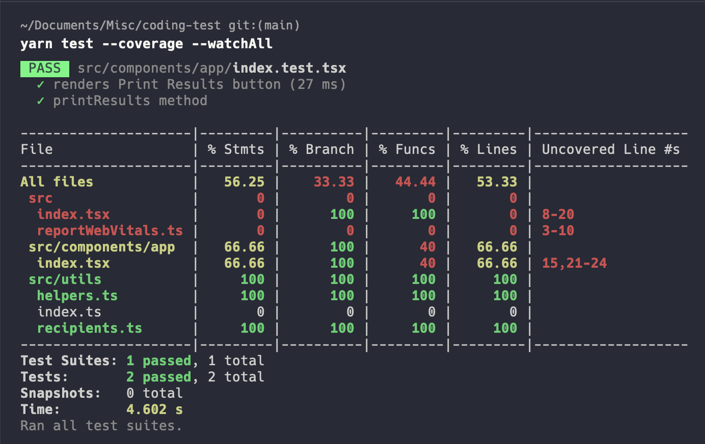

# React

This project was bootstrapped with [Create React App](https://github.com/facebook/create-react-app).

## Prerequisite
- Node v14+
- npm / yarn

## Development server

Run `yarn start` for a dev server. Navigate to `http://localhost:3000`. The app will automatically reload if you change any of the source files.

## Build

Run `yarn build` to build the project. The build artifacts will be stored in the `build/` directory.

## Running tests

Run `yarn test` to execute the tests via [Jest](https://jestjs.io/). And for test coverage simply run `yarn test --coverage --watchAll`. Below is the sample test coverage report

